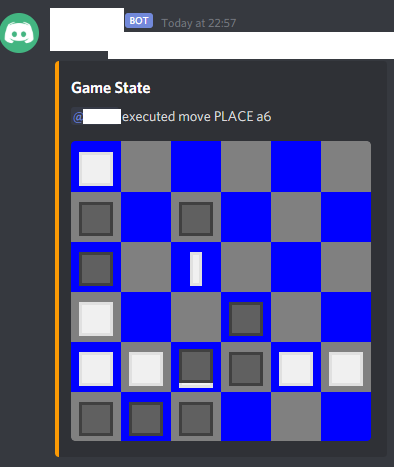

### Discord Tak Bot
This bot takes messages with commands in [Portable Tak Notation](https://ustak.org/portable-tak-notation/), executes them on a board and then sends a message with the new board state.



### How to play

- `$create -s3|4|5|6|7|8 -white|black|random -public|secret`
  - `-sn` with `n` being the board size
  - `-white` or `-black` or `-random`: The colour you as the game creator want to have
  - Optional `-public` `-secret`
    - `-public` everyone can read and write messages.
    - `-secret` only you and your opponent can see the channel. **Only you can invite others**.
    - Default: **Everyone can see** the channel and read messages but **only you and your opponent can write messages**.
- `$show` Shows the game of the current channel and who's turn it is
- Doing game moves
  - You must be in a channel with a game, one of the players and it must be your turn
  - Commands start with a `$` and the rest is as usual e.g. `$a1` to place a flat in the lower left corner or `$f6` for the top right one
  - Moving a stack would be `$5b3>212`

### How to run
#### Requirements
- A discord bot token [how to create a bot](https://discordpy.readthedocs.io/en/latest/discord.html)
- Bot access to your server with the following priviliges
  - Go to [discord apps](https://discord.com/developers/applications), select your app, go to `OAuth2` and in the URL generator set
    - `scope=bot`
    - `Bot Permissions`
      - `General`
        - `Manage Channels`
        - `Create Instant Invite`
      - `Text Permissions`
        - `Send Messages`
        - `Manage Messages`
        - `Embed Links`
        - `Attach Files`
  - Visit the generated URL, select the server you want the bot to have access to and grant it
- Python3 `3.9.0` (I'm not very versed around python's versioning and compatibility, these are just the versions I use)
  - `discord.py 1.5.1`
  - `Pillow 8.0.1` (PIL / Python Image Library)
  - `pytest 6.1.2`
  - For devs
    - `discord.py-stubs 1.5.1.2` (types, recommended for development only)
  - If you're using anaconda which is still on `Python 3.7.6` and
    ```
    conda create -n py39 python=3.9
    conda activate py39
    pip install discord.py discord.py-stubs Pillow pytest
    ```

#### Run
- Configure `botsettings.json` with your bot token
  - If you are a dev, you may a copy of `botsettings.json` called `botsettings.dev.json` and edit it as it will be ignored by git.
- Run `python3 .` in the root of the repository.

#### Test (for devs)
- Run `pytest` or `python -m pytest` in the root folder
- Or utilize VS Codes Test Explorer
  - It could be worth to add the following to your `ctrl+shift+p Keyboard Shortcuts (JSON)` to easily re-run them
    ```
    {
      "key": "ctrl+r ctrl+a",
      "command": "python.runtests"
    },
    ```

### TODO
- [ ] Commands to create and configure games
  - [x] Move game to private channel that are just created for these games
    - [ ] Clean up code
  - [x] Maintain multiple games, one per channel
    - [ ] Clean up code
  - [ ] Create certain gamestate from PTN as a starting point for the game
- [x] Let users only play their own color
- [ ] If a move fails the board may be left in a half-way state
  - This can happen when moving a stack and part of that is dropping stones on standing/cap stones. This aborts the move but it doesn't undo what has already happened.
- [ ] Persist game state between restarts
- [ ] Recognise game ending positions and winner
  - [ ] Road
  - [ ] Board full
  - [ ] All stones used
  - [ ] Resignation
- [ ] Add link to [ptn.ninja](https://ptn.ninja/) to allow users to play around before committing to a move
- [ ] Allow multiple users to control one side?
- [ ] Undo move?
